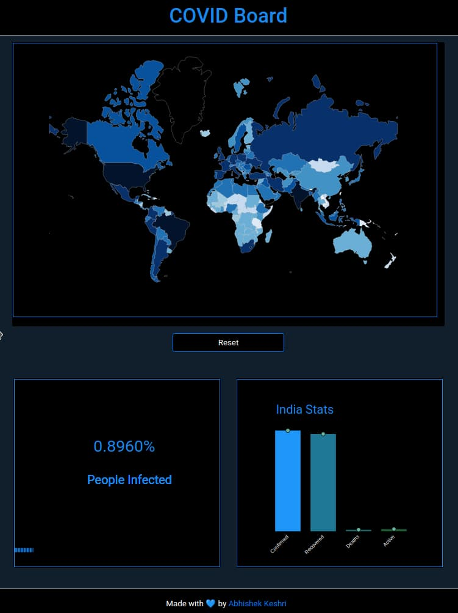

<div align = "center">

<h1><a href="https://2kabhishek.github.io/covid-board">Covid Board</a></h1>

<a href="https://github.com/2KAbhishek/covid-board/blob/main/LICENSE">
 </a>

<a href="https://github.com/2KAbhishek/covid-board/pulse">
 </a>

<a href="https://github.com/2KAbhishek/covid-board/stargazers">
</a>

<a href="https://github.com/2KAbhishek/covid-board/network/members">
 </a>

<a href="https://github.com/2KAbhishek/covid-board/watchers">
 </a>

<a href="https://github.com/2KAbhishek/covid-board/graphs/contributors">
 </a>

<a href="https://github.com/2KAbhishek?tab=followers">
 </a>

<h3>Track Covid accross the globe 😷🌏</h3>

<figure>
  
  <br/>
  <figcaption>covid-board screenshot</figcaption>
</figure>

</div>

## What is this

Covid Board is a dashboard that tracks the Covid-19 pandemic across the globe.

## Inspiration

Seen too many versions of the dashboard, and wanted to make one myself.

## Prerequisites

Before you begin, ensure you have met the following requirements:

- You have installed the latest version of `a web browser, a live web server`

## Getting covid-board

To install covid-board, follow these steps:

```bash
git clone https://github.com/2kabhishek/covid-board
cd covid-board
```

## Using covid-board

Run live demo:

open `index.html` preview using live server

## How it was built

covid-board was built using `VS Code, D3.js, HTML, CSS, & JavaScript`.

## Challenges faced

Figuring out `D3.js` and it's syntax initially was tricky.

## What I learned

- Learned about `D3.js` and it's usage
- Built a live world map.

## What's next

Make more projects with `D3.js`

Hit the ⭐ button if you found this useful.

## More Info

<div align="center">

<a href="https://github.com/2KAbhishek/covid-board">Source</a> | <a href="https://2kabhishek.github.io/covid-board">Website</a>

</div>
